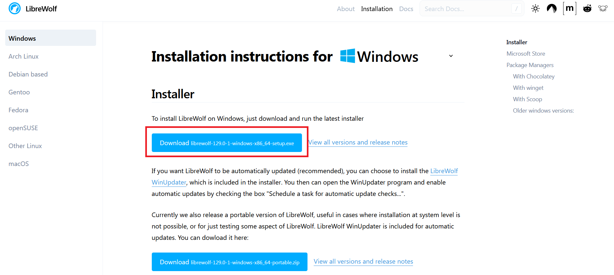
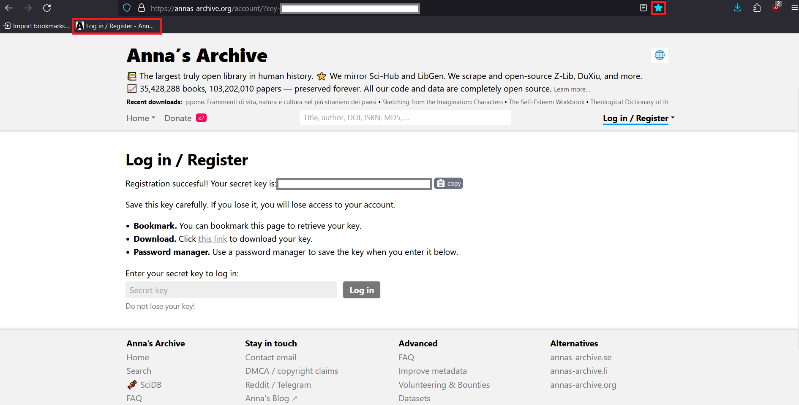
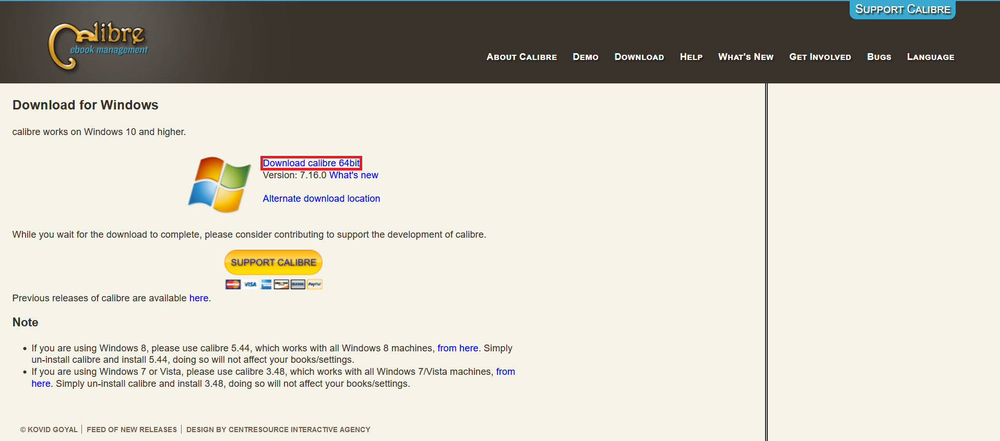
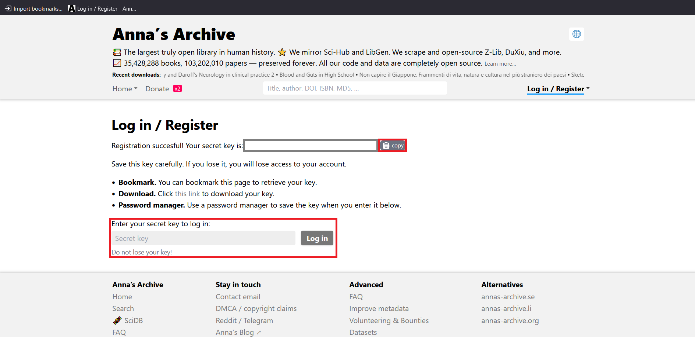
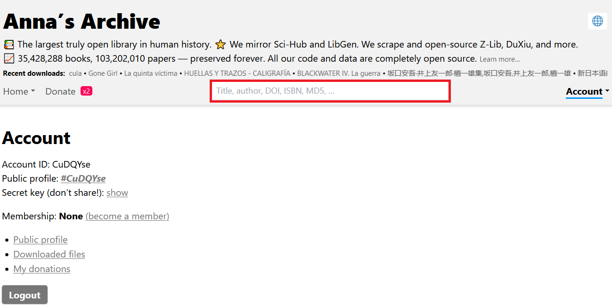
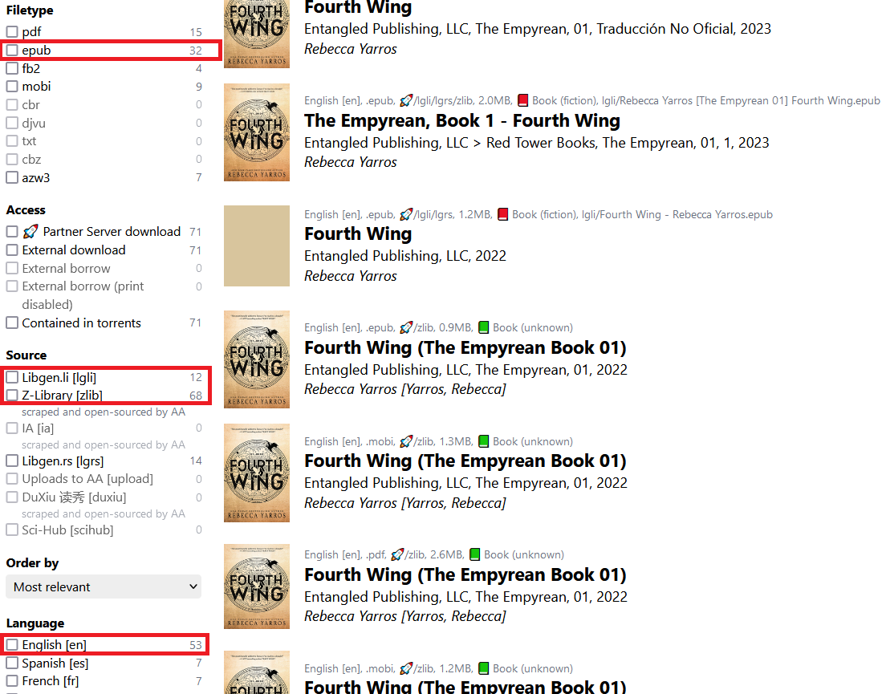
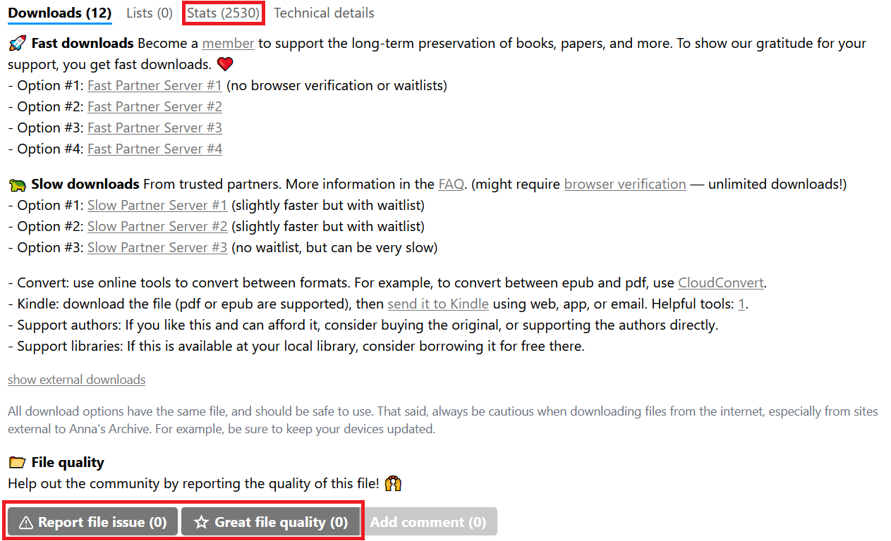
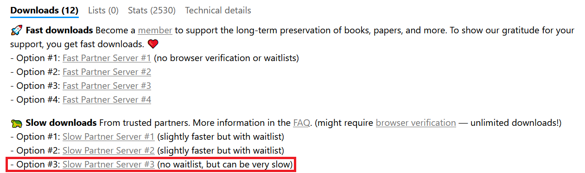
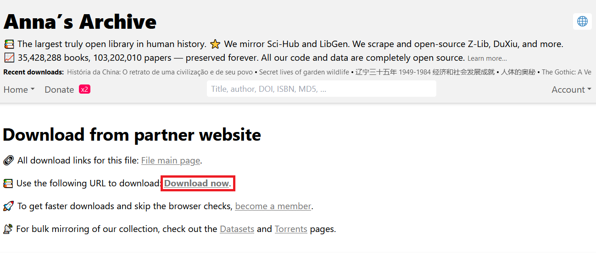

# Anna's Archive Guide

Welcome to the Anna's Archive Guide! This repository provides a step-by-step guide for newcomers on how to use Anna's Archive efficiently and with some additional privacy and safety precautions.

## Table of Contents

1. [Setup (First-Time Users)](#setup-first-time-users)
2. [Accessing Anna's Archive (Registered Users)](#accessing-annas-archive-registered-users)
3. [Searching and Downloading](#searching-and-downloading)
4. [Using Calibre with Your E-Reader](#using-calibre-with-your-e-reader)
5. [Tips and Tricks](#tips-and-tricks)
6. [Troubleshooting and FAQs](#troubleshooting-and-faqs)
7. [License](#license)

## Setup (First-Time Users)

Follow these steps to set up your browser and account:

1. **Download LibreWolf (Optional)**:
   - You can use Anna's Archive with your usual browser. Installing LibreWolf is not mandatory.
   - LibreWolf provides stronger default protection against some trackers, cookies, and browser fingerprinting than browsers such as Chrome or Edge.
   - It does not hide your public IP address and does not make you anonymous.
   - Visit [LibreWolf's official installation page](https://librewolf.net/installation/).
   - Select the appropriate operating system and follow the installation instructions.
   

2. **Visit Anna's Archive**:
   - Go to one of the current Anna's Archive mirrors:
     - [annas-archive.pk](https://annas-archive.pk/)
     - [annas-archive.gd](https://annas-archive.gd/)
     - [annas-archive.gl](https://annas-archive.gl/)
   - Anna's Archive uses mirrors so that the service can remain available when one domain is blocked, suspended, or taken down.
   - If the links above no longer work, a common practice is to check the domains listed on the [Anna's Archive Wikipedia page](https://en.wikipedia.org/wiki/Anna%27s_Archive), which is often updated when the official mirrors change.
   - Be careful: fake mirrors and impersonation websites exist. Check the exact spelling of the domain and avoid random or sponsored search results before entering a secret key or downloading anything.

<details>
<summary><strong>Optional: Verify an Anna's Archive announcement with its signing key</strong></summary>

Anna's Archive has published a public signing key that can be used to verify signed announcements, including announcements about new domains.

This is optional and intended for users who want a stronger way to check authenticity.

### Expected Fingerprint

```text
0D71 8B0A 3412 9CE1 AB50 42DF DB31 2C32 7E58 6040
```

### Public Key

Save the following content in a file named `annas-archive-public-key.asc`:

```text
-----BEGIN PGP PUBLIC KEY BLOCK-----

xjMEAAAAABYJKwYBBAHaRw8BAQdALQ/QcjyTg8kjI3qpoudsCX+jwh5tl2ExBBm0
LgE9hHnNDkFubmEgQXJjaGl2aXN0wmEEExYIABMFAgAAAAAJENsxLDJ+WGBAAhsD
AABppwEArVPP1JLxdnnahvHiiG6CpqnGdylqBDJ4YGwYcwP7Qk4BAIVFVYmd0aQg
Yf6q+OhORfJN9w+ytvUQ/q3p2fSFweEL
=keqc
-----END PGP PUBLIC KEY BLOCK-----
```

### Install GnuPG

- **Windows**: Install [Gpg4win](https://www.gpg4win.org/).
- **macOS with Homebrew**:

```bash
brew install gnupg
```

- **Debian or Ubuntu**:

```bash
sudo apt install gnupg
```

### Import the Key

Open a terminal in the folder containing the key and run:

```bash
gpg --import annas-archive-public-key.asc
```

### Check the Fingerprint

Run:

```bash
gpg --fingerprint "Anna Archivist"
```

Make sure the displayed fingerprint is exactly:

```text
0D71 8B0A 3412 9CE1 AB50 42DF DB31 2C32 7E58 6040
```

Stop if the fingerprint is different.

### Verify a Signed Announcement

For an announcement and a separate signature file:

```bash
gpg --verify announcement.txt.asc announcement.txt
```

For a clear-signed announcement contained in one file:

```bash
gpg --verify announcement.asc
```

A valid result should include a message similar to:

```text
Good signature from "Anna Archivist"
```

Also verify that:

- The fingerprint matches the expected fingerprint above.
- The signed message clearly names the announced domain.
- The announcement is recent.
- The message has not been revoked or replaced.

A valid signature proves that the message was signed by the matching private key. It does not make every website using the Anna's Archive name trustworthy.

</details>

3. **Register an Account (Optional)**:
   - Registration is not required for basic searching and slow downloads.
   - To register, click on "Log in / Register" on the homepage.
   - Select "Register new account."
   - Store the secret key in a password manager or an encrypted offline note.
   - Treat the secret key like a password. Do not save it in a synchronized bookmark, screenshot, email, or public message.
   

4. **Download Calibre**:
   - Visit [Calibre's website](https://calibre-ebook.com/).
   - Click on "Download calibre" and select the appropriate operating system.
   - For Windows users, click on "Download calibre 64bit." Select the equivalent option for other operating systems.
   

## Accessing Anna's Archive (Registered Users)

Registration is optional. Skip this section if you are using Anna's Archive without an account.

1. **Log In**:
   - Open one of the verified Anna's Archive mirrors.
   - Click on "Log in / Register."
   - Copy the secret key from your password manager or encrypted backup and paste it into the "Secret key" field to log in.
   

## Searching and Downloading

1. **Search for Resources**:
   - Use the search bar to enter the Title, Author, DOI, ISBN, ASIN, MD5, etc.
   

2. **Refine Search Results**:
   - Use the sidebar filters to refine your search:
     - **Filetype**: Choose `epub` when available. EPUB is usually the best format for ordinary books on an e-reader because the text adapts to the screen. Avoid PDF when a good EPUB version is available.
     - **Source**: You can disable sources you do not trust. For example, it is possible to disable books coming from the Russian Libgen source `Libgen.rs`. The `.rs` part is the source's domain, not the book's file extension.
     - **Language**: Select the desired language.
   

3. **Open Multiple Options**:
   - Open at least the first three options for the book in new tabs.

4. **Evaluate Download Options**:
   - Check the "Report file issue" number:
     - Avoid downloading files with reports related to malware, corruption, or the wrong book.
     - If the reported issue is only download difficulty, the file may still be usable.
     - No reports does not guarantee that a file is safe.
   - Check the "Stats" number:
     - Prefer options with higher statistics for better reliability.
     - A more popular file has usually been used by more people, but popularity is only an indicator and not proof that the file is safe.
   - Confirm the title, author, language, edition, file type, and approximate file size.
   

<details>
<summary><strong>Optional: Perform a stronger file-safety check</strong></summary>

The checks above are useful indicators, but they are not foolproof. Users who want a stronger check can follow these additional steps.

### 1. Require an Exact `.epub` Extension

For this guide, the downloaded file should end exactly with:

```text
book-name.epub
```

If the file has any other extension, a double extension, or an archive extension, delete it.

Examples to delete:

```text
book-name.epub.exe
book-name.pdf
book-name.zip
book-name.rar
book-name.7z
book-name.apk
```

On Windows, enable **View > Show > File name extensions** in File Explorer so that the complete filename is visible.

A file ending in `.epub` can still be malicious, so continue with the VirusTotal scan below.

### 2. Do Not Open the File on the Computer

Before the scan:

- Do not double-click the file.
- Do not preview it.
- Do not extract it with 7-Zip, WinRAR, or another archive tool.
- Do not open it in a browser or e-book reader.
- Do not import it into Calibre.

The objective is to avoid having the computer's e-book software parse or display the file before it has been checked.

### 3. Scan the File with VirusTotal

1. Go to the official [VirusTotal website](https://www.virustotal.com/).
2. Select the **File** tab.
3. Click **Choose file**.
4. Select the downloaded `.epub` file.
5. Confirm the upload.
6. Wait for the analysis to finish.
7. Review the security-vendor results.

Delete the file if VirusTotal reports it as malicious or suspicious.

If VirusTotal reports no detection, the file has passed this check, but no scanner can guarantee that every threat will be detected.

> **Privacy notice:** Files uploaded through the normal VirusTotal service may be shared with VirusTotal's security partners. Do not upload private, confidential, personal, or sensitive documents.

### 4. Transfer the EPUB Directly to the E-Reader

If you plan to read the book only on an e-reader, avoid opening it on the computer after the scan.

1. Connect the e-reader to the computer with a USB cable.
2. Open the e-reader's storage in File Explorer, Finder, or your file manager.
3. Locate the folder used for books, commonly named `Books`, `Documents`, or `Digital Editions`.
4. Copy the checked `.epub` file directly into that folder.
5. Wait for the copy to finish.
6. Safely eject the e-reader.
7. Open the book only on the e-reader.

This reduces the computer's exposure to e-book parsing. It does not make the e-reader itself invulnerable, so keep its software or firmware updated.

### Important Note About Calibre

Calibre does not merely store the file when a book is added. It automatically reads metadata from the e-book and creates a copy in its library.

If your objective is to avoid having the computer process the EPUB, do not import that file into Calibre. Use the direct USB-transfer method above instead.

</details>

5. **Download the Book**:
   - Go to the downloads tab and select the option labeled "(no waitlist, but can be very slow)" when it is available. This is usually the simplest free option, although the download may take time.
   
   - Click "Download now" in a new tab.
   - Choose the download location and keep the book name intact.
   - Organize your downloads by creating a folder for each day's downloads.
   - Avoid starting several downloads simultaneously. Multiple downloads may fail, stop partway through, or make each other slower. For better reliability, let one book finish before starting the next one.
   

## Using Calibre with Your E-Reader

> **Important:** Adding a book to Calibre makes Calibre read its metadata and copy the file into its library. If you want to avoid having the computer process the EPUB, use the direct USB-transfer method in the optional file-safety section instead.

Use Calibre only when you want its library, metadata-editing, conversion, or device-management features.

1. **Open Calibre**:
   - Launch the Calibre application on your computer.

2. **Add Books to Calibre**:
   - Drag and drop the books you downloaded into the Calibre app.

3. **Connect Your E-Reader**:
   - Connect your e-reader to your computer.
   - Wait for Calibre to recognize the e-reader.

4. **Send Books to Your E-Reader**:
   - Select the books in Calibre.
   - Click on "Send to device" to transfer the books to your e-reader.
   - Monitor the jobs in the bottom-right corner to ensure the transfer is complete.

5. **Disconnect Your E-Reader**:
   - Safely eject your e-reader like a USB drive to avoid data corruption.
   - Enjoy reading your new books!

## Tips and Tricks

- **Amazon as a Resource**:
  - Look up the book or series on Amazon for easy identification.
  - Click on the series name to view all book titles and covers.
  - Find the ASIN of the book on Amazon to use it in your search.

- **Managing Series and Metadata in Calibre**:
  - To ensure your books are recognized as part of a series with the correct author, edit metadata in Calibre before transferring to your e-reader.
  - Right-click the book and select "Edit metadata" > "Edit metadata individually."
  - In the series field, enter the series name (ensure consistency with casing and spelling).
  - Enter the book's number in the series.
  - Correct any typos in the author name and author sort fields.
  - For multiple books, select them all and use "Edit metadata" > "Edit metadata in bulk."

## Troubleshooting and FAQs

- **Common Issues**:
  - **Download Failures**: Ensure your internet connection is stable. Retry if needed. If the problem continues, try another result or another verified Anna's Archive mirror.
  - **Logging In**: Make sure you are using the correct secret key and a verified Anna's Archive mirror.

- **FAQs**:
  - **Do I need to register an account?**
    - No. Registration is optional for basic searching and slow downloads.
  - **Can I download multiple books at once?**
    - It may be possible, but simultaneous downloads can fail or interrupt one another. For better reliability, download one book at a time.
  - **Does LibreWolf make me anonymous?**
    - No. LibreWolf can reduce some browser tracking, but it does not hide your public IP address.
  - **Is EPUB completely safe?**
    - No file format is completely safe. EPUB is generally convenient for books and e-readers, but files should still be opened with updated software.

## License

This project is licensed under the MIT License. See the [LICENSE](LICENSE) file for details.
