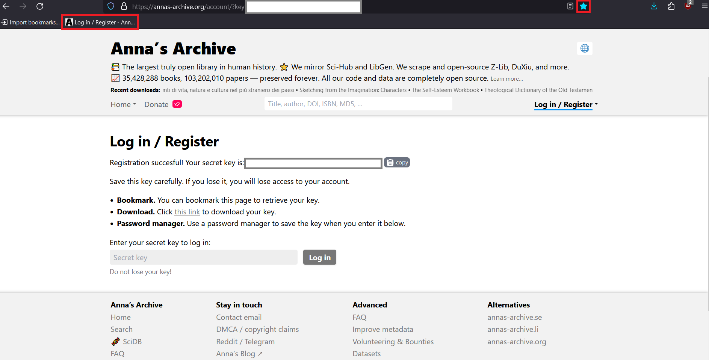
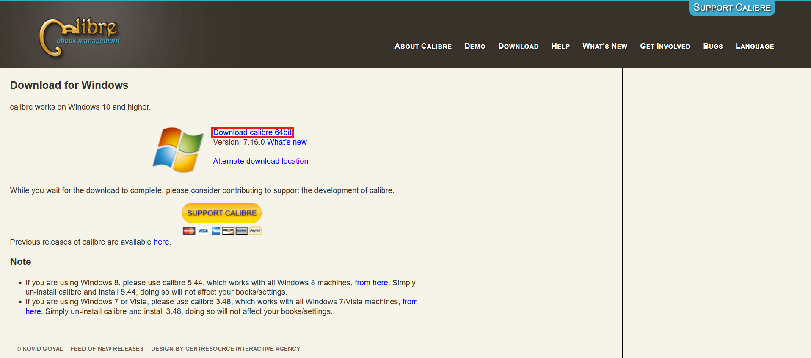

# Anna's Archive Guide

Welcome to the Anna's Archive Guide! This repository provides a step-by-step guide for newcomers on how to use Anna's Archive efficiently and safely. Follow these instructions to access a wealth of resources while maintaining your privacy.

## Table of Contents

1. [Setup (First-Time Users)](#setup-first-time-users)
2. [Accessing Anna's Archive (Registered Users)](#accessing-annas-archive-registered-users)
3. [Searching and Downloading](#searching-and-downloading)
4. [Using Calibre with Your E-Reader](#using-calibre-with-your-e-reader)
5. [Tips and Tricks](#tips-and-tricks)
6. [Troubleshooting and FAQs](#troubleshooting-and-faqs)
7. [License](#license)

## Setup (First-Time Users)

Follow these steps to set up your browser and account:

1. **Download LibreWolf**:
   - Visit [LibreWolf's website](https://librewolf.net/).
   - Click on "Installation."
   - Select the appropriate operating system.
   - Click on "Download librewolf-///./-/-windows-x86_64-setup.exe" or the equivalent option for your operating system.
   

2. **Visit Anna's Archive**:
   - Go to [Anna's Archive](https://annas-archive.org/).

3. **Register an Account**:
   - Click on "Log in / Register" on the homepage.
   - Select "Register new account."
   - Save the registration successful page as a bookmark. This page contains your secret key, which is essential for logging in.
   

4. **Download Calibre**:
   - Visit [Calibre's website](https://calibre-ebook.com/).
   - Click on "Download calibre" and select the appropriate operating system.
   - For Windows users, click on "Download calibre 64bit." Select the equivalent option for other operating systems.
   

## Accessing Anna's Archive (Registered Users)

1. **Log In**:
   - Click on the bookmark you saved during registration to access the website.
   - Copy the secret key from the bookmark and paste it into the "Secret key" field to log in.
   

## Searching and Downloading

1. **Search for Resources**:
   - Use the search bar to enter the Title, Author, DOI, ISBN, MD5, etc.
   

2. **Refine Search Results**:
   - Use the sidebar filters to refine your search:
     - **Filetype**: Choose `epub`.
     - **Source**: Avoid sources with `.rs` extension for safer downloads.
     - **Language**: Select the desired language.
   

3. **Open Multiple Options**:
   - Open at least the first three options for the book in new tabs.

4. **Evaluate Download Options**:
   - Check the "Report file issue" number:
     - Avoid downloading files with issues related to malware.
     - If the issue is only download difficulty, it's generally safe.
   - Check the "Stats" number:
     - Prefer options with the highest stats number for better reliability.
   

5. **Download the Book**:
   - Go to the downloads tab and select the option labeled "(no waitlist, but can be very slow)."
   - Click "Download now" in a new tab.
   - Choose the download location and keep the book name intact.
   - Organize your downloads by creating a folder for each day’s downloads.
   - Note that you cannot download multiple books simultaneously.
   

## Using Calibre with Your E-Reader

1. **Open Calibre**:
   - Launch the Calibre application on your computer.
   

2. **Add Books to Calibre**:
   - Drag and drop the books you downloaded into the Calibre app.
   

3. **Connect Your E-Reader**:
   - Connect your e-reader to your computer.
   - Wait for Calibre to recognize the e-reader.
   

4. **Send Books to Your E-Reader**:
   - Select the books in Calibre.
   - Click on "Send to device" to transfer the books to your e-reader.
   - Monitor the jobs in the bottom-right corner to ensure the transfer is complete.
   

5. **Disconnect Your E-Reader**:
   - Safely eject your e-reader like a USB drive to avoid data corruption.
   - Enjoy reading your new books!
   

## Tips and Tricks

- **Amazon as a Resource**:
  - Look up the book or series on Amazon for easy identification.
  - Click on the series name to view all book titles and covers.
  - Find the ASIN of the book on Amazon to use it in your search.

- **Managing Series and Metadata in Calibre**:
  - To ensure your books are recognized as part of a series with the correct author, edit metadata in Calibre before transferring to your e-reader.
  - Right-click the book and select "Edit metadata" > "Edit metadata individually."
  - In the series field, enter the series name (ensure consistency with casing and spelling).
  - Enter the book's number in the series.
  - Correct any typos in the author name and author sort fields.
  - For multiple books, select them all and use "Edit metadata" > "Edit metadata in bulk."

## Troubleshooting and FAQs

- **Common Issues**:
  - **Download Failures**: Ensure your internet connection is stable. Retry if needed.
  - **Logging In**: Make sure you are using the correct secret key.

- **FAQs**:
  - **Can I download multiple books at once?**
    - No, Anna's Archive currently supports only one download at a time.

## License

This project is licensed under the MIT License. See the [LICENSE](LICENSE) file for details.
